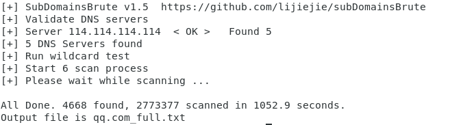

# subDomainsBrute 1.5 #

A fast subdomain brute tool for pentesters, designed to work with Python 3.6+.

高并发的DNS暴力枚举工具，支持Python3.6+，建议使用Python3.8+。

## Install ##
Python3.6+ users: `pip install dnspython==2.2.1 async_timeout`

## New Features

* 支持从HTTPS证书中获取更多子域名
* 增加对Windows下Proactor事件循环的支持，以提升并发性能

## ScreenShot ##

使用大字典，扫描qq.com



## Usage ##

```
Usage: subDomainsBrute.py [options] target.com

Options:
  --version             show program's version number and exit
  -h, --help            show this help message and exit
  -f FILE               File contains new line delimited subs, default is
                        subnames.txt.
  --full                Full scan, NAMES FILE subnames_full.txt will be used
                        to brute
  -i, --ignore-intranet Ignore domains pointed to private IPs
  -w, --wildcard        Force scan after wildcard test failed
  -t THREADS, --threads=THREADS
                        Num of scan threads, 500 by default
  -p PROCESS, --process=PROCESS
                        Num of scan processes, 6 by default
  --no-https            Disable getting domain names from HTTPS cert, this can
                        save some time
  -o OUTPUT, --output=OUTPUT
                        Output file name. default is {target}.txt
```

## Change Log ##

* [2022-06-14] Version 1.5, some improvements
  * 增加支持通过HTTPS证书获取子域名
  * 更好的兼容性。使用 Python 3.6 / 3.7 / 3.8 / 3.10 测试
  * Windows下通过Proactor事件循环缓解进程句柄限制